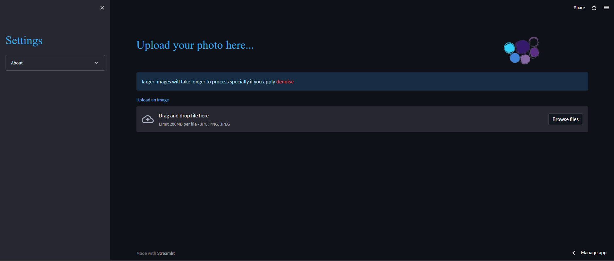
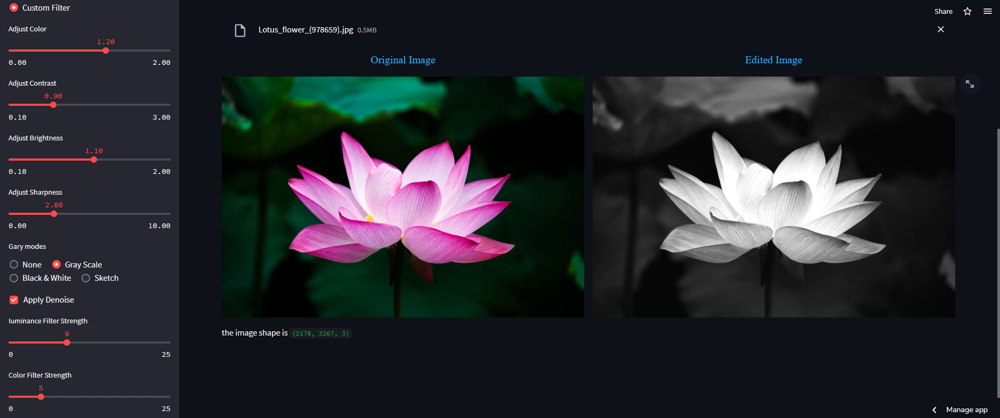

# Photo-editing-app-streamlit
 - a web application created with streamlit that uses opencv and PIL to edit photos
- try it on streamit

### Preview

- this is the main page of the app where you can upload your photo and choose the effect you want to apply to it
[
- this is the result of applying some effects to a photo
[

